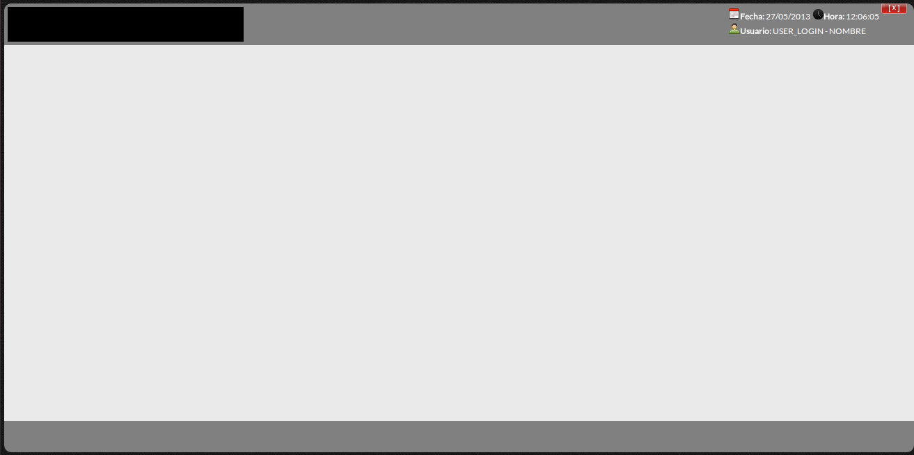

geekcode_php
============

Framework de trabaja en conjunto con librerías de Zend framework 1.12.3(para el Back) y  
Extjs 4.x(Para el Front)

Configuración
-------------

Bueno primeramente antes de todo, bajamos las fuentes del proyecto y la colocamos en un  
directorio cualquiera, como por ejemplo: `/sistemas/` (linux) `C:\sistemas\` (windows), por motivos  
de seguridad no es recomendable que el proyecto se ubique en el directorio raíz de nuestro  
servidor web.  
Luego vamos a verificar que tenemos configuradas ciertas cosas  
para que el proyecto se ejecute con normalidad.

### Apache

Vamos a modificar pequeñas cosas en el archivo httpd.conf(solo pequeñas cosas, nada del otro mundo)  
En este punto vamos a explicar la modificación del archivo mencionado anteriormente en diversas  
plataformas (Linux y/o Windows).

#### Linux(Distro: Ubuntu)

> * Abrir una terminal y ejecutar el siguiente comando:  
``` bash
a2enmod rewrite && sudo invoke-rc.d apache2 restart
```  
Con ese comando habilitamos el manejo de url limpias.  

> * Modificamos el httpd.conf con el siguiente comando:  
``` bash
sudo vim /etc/apache2/httpd.conf
```  

Una vez ahí agregamos lo siguiente al final:  
``` apache
# Acá podemos direccionar al puerto de nuestro agrado, pero verificar que no este  
# ocupado por otro proceso
NameVirtualHost *:8080
Listen *:8080
<VirtualHost *:8080>
  	# Acá indicamos la ruta en la cual ha sido colocado el proyecto, en este caso en
  	# carpeta /sistemas/
  	DocumentRoot "/sistemas/geekcode_php/public_html"
  	DirectoryIndex index.php
  	# Acá indicamos la ruta en la cual ha sido colocado el proyecto, en este caso en
  	# carpeta /sistemas/
  	<Directory "/sistemas/geekcode_php/public_html">
    	AllowOverride All
    	Allow from All
  	</Directory>
</VirtualHost>
```  
Grabamos los cambios `wq!`, y luego reiniciamos el servidor web, en este caso apache  
`sudo /etc/init.d/apache2 restart`  

> * Si todo ha marchado a la normalidad hasta ahora, el proyecto estaría listo para  
su ejecución, así que ahora vamos a ingresar al navegador web, y colocamos:  
`http:\\localhost:8080\` y deveriamos de ver la siguiente pantalla:  
  

#### Windows

> * Configurar todo lo que se va mencionar a continuación:  

``` apache
# Activar en C:\AppServ\Apache2.2\conf\httpd.conf :
LoadModule vhost_alias_module module/mod_vhost_alias.so
# Activar en C:\AppServ\Apache2.2\conf\httpd.conf :
Include conf/extra/httpd-vhosts.conf
# activar en C:\AppServ\Apache2.2\conf\httpd.conf :
LoadModule rewrite_module modules/mod_rewrite.so
# ----------------------------------------------------------------
Host virtual en: C:\AppServ\Apache2.2\conf\extra\httpd-vhosts.conf
# Borras todo lo que esta dentro y pones esto:
NameVirtualHost *:8080
Listen *:8080
<VirtualHost *:8080>
    DocumentRoot "C:/sistemas/geekcode_php/public_html"
    DirectoryIndex index.php
    <Directory "C:/sistemas/geekcode_php/public_html">
        AllowOverride All
        Allow from All
    </Directory>
</VirtualHost>
```  
> * Reiniciar el servidor web.  
> * Si todo ha marchado a la normalidad hasta ahora, el proyecto estaría listo para  
su ejecución, así que ahora vamos a ingresar al navegador web, y colocamos:  
`http:\\localhost:8080\` y deveriamos de ver la siguiente pantalla:  
  

Créditos
--------

* [Twitter](https://twitter.com/remicioluis) (@remicioluis)
* [Facebook](https://www.facebook.com/luis.remicioobregon) (Luis Remicio)  

Agradecimientos
---------------

* [Extjs](http://www.sencha.com/products/extjs/)
* [Zend Framework](http://framework.zend.com/)
